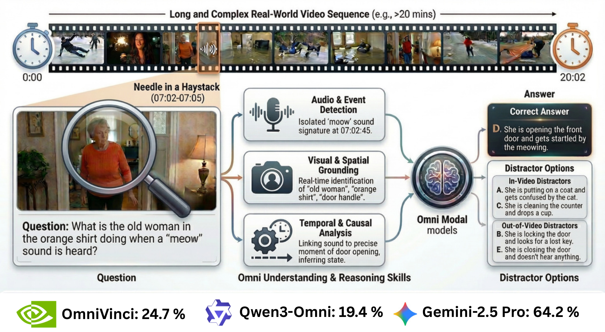
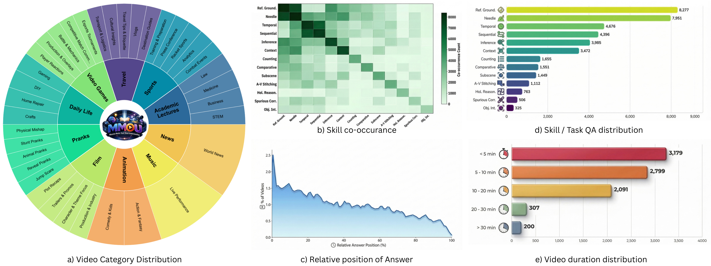

<p align="center">
  
</p>

<h1 align="center">MMOU</h1>

<p align="center"><strong>Massive Multi-Task Omni Understanding</strong></p>

<p align="center">
  <a href="https://huggingface.co/datasets/nvidia/MMOU">HuggingFace</a>
  ·
  <a href="https://huggingface.co/datasets/sonalkum/MMOU-Videos">Video Assets</a>
  ·
  <a href="https://arxiv.org/">Paper</a>
</p>

<p align="center">
  MMOU evaluates joint audio-visual understanding and reasoning in long, complex real-world videos.
</p>

## Dataset Summary

MMOU is a benchmark for evaluating whether multimodal models can jointly reason over video, speech, sound, music, and long-range temporal context in real-world videos. The central challenge is not single-modality recognition in isolation, but tightly coupled audio-visual understanding over extended time horizons where evidence can be sparse, delayed, or distributed across multiple moments.

Current models still fail substantially under this setting. Even the strongest systems remain far below human performance when they must integrate both audio and vision across long videos rather than rely on language priors, a single modality, or short-context pattern matching.

> **Accessing the videos**
>
> The benchmark annotations, questions, and evaluation logic are documented on `nvidia/MMOU`, but the actual MP4 files and captions are hosted separately at [`sonalkum/MMOU-Videos`](https://huggingface.co/datasets/sonalkum/MMOU-Videos). Researchers who want to run the benchmark need both repositories.



## Dataset Statistics

| Category | Value |
| --- | --- |
| QA pairs | 15,000 |
| Web-collected videos | 9,038 |
| Video resolution | 720p |
| Average video duration | 711.6 seconds |
| Duration range | 7 to 7,255 seconds |
| Major domains | 10 |
| Fine-grained subcategories | 36 |
| Skill categories | 13 |
| Average skills per question | roughly 3 simultaneously |
| Evaluated models | 20+ |

MMOU spans long-form real-world videos collected from the web and was designed to stress temporal grounding, cross-modal reasoning, and robustness to long context rather than short-clip recognition.

## Domains and Benchmark Coverage

MMOU covers ten broad domains:

- Academic Lectures
- Animation
- Daily Life
- Film
- Music
- News
- Pranks
- Sports
- Travel
- Video Games

These domains are further broken into 36 subcategories to expose models to a wide range of real-world audio-visual conditions, narrative structures, and failure modes.



## The 13 Skill Categories

Each MMOU question is tagged with one or more reasoning skills, and questions require roughly three skills simultaneously on average. The benchmark covers:

- Temporal understanding
- Sequential reasoning
- Needle-in-the-haystack reasoning
- Referential grounding
- Context understanding
- Inference
- Counting
- Comparative reasoning
- Sub-scene understanding
- Audio-visual stitching
- Holistic reasoning
- Object interaction
- Spurious correlations

This multi-skill design is deliberate: MMOU is meant to test genuine omni-modal reasoning rather than isolated pattern recognition.

## Data Construction and Annotation

MMOU is built through a human-in-the-loop pipeline designed to preserve strict audio-visual dependency and long-horizon reasoning difficulty.

1. **Expert question authoring.** Eleven expert annotators watch full videos and write open-ended question-answer pairs that require joint audio and visual understanding. Questions answerable from text alone or from a single modality are filtered out.
2. **Timestamp grounding.** Annotators mark the temporal span where answer-relevant evidence appears, which enables analysis of where evidence occurs inside long videos.
3. **Multiple-choice conversion.** GPT-5.2 is used to generate nine hard distractors for each open-ended question, producing ten answer options in total. Half of the distractors are plausible and in-context; the remaining half are intentionally out-of-context.
4. **None-of-the-above defense.** "None of the above" is intentionally used in 26% of the released questions to reduce shortcut strategies based on elimination or option-pattern heuristics.
5. **Quality control.** A separate review pass removes ambiguous, redundant, weakly grounded, or misaligned questions before final release.

## Evaluation Methodology

### Multiple-Choice Evaluation

- MMOU multiple-choice performance is reported with **micro-averaged accuracy**.
- Each item contains **10 options**, making random guessing a 10% baseline.
- The benchmark is explicitly designed so that unimodal or text-only shortcuts are insufficient for strong performance.

### Open-Ended Evaluation

Open-ended evaluation complements MCQ accuracy by testing whether models can generate free-form answers without access to answer choices.

- **Judge models:** GPT-5 and a custom Qwen 3.5 0.8B judge.
- **Rubric dimensions:** Correctness, Completeness, Faithfulness, and Clarity.
- **Judge inputs:** question, ground-truth answer, model response, and a detailed audio-visual caption.
- **Important restriction:** the caption is used only by the judge during evaluation and should not be fed to the model under test.

## Key Findings and Leaderboard

| System | Setting | Score |
| --- | --- | ---: |
| Human | Reference baseline | 84.3 |
| Gemini 2.5 Pro | Best closed-source omni model | 64.2 |
| MiniCPM-o 4.5 | Best open-source omni model | 46.8 |
| Qwen3-Omni-30B-A3B-Instruct | Open-source omni model | 46.0 |
| Qwen3-VL-32B-Instruct | Vision-only baseline | 44.0 |
| GPT-5.2 | Text-only baseline | 40.7 |
| Qwen3-Omni-30B-A3B | Audio-only baseline | 35.6 |
| Audio Flamingo 3 | Audio-only baseline | 17.7 |

### Main Takeaways

- **Human performance remains far ahead.** The benchmark remains unsolved even for the strongest closed-source systems.
- **Open-source omni models still trail significantly.** MiniCPM-o 4.5 and Qwen3-Omni-30B-A3B-Instruct are the strongest open models, but both remain far below human accuracy.
- **Unimodal models fail clearly.** Vision-only, audio-only, and text-only baselines all underperform compared with strong end-to-end omni models, showing that MMOU requires genuine cross-modal reasoning.
- **Long videos remain a core bottleneck.** Errors persist even when models are otherwise strong on short-context multimodal tasks.

## Limitations and Biases

- MMOU is built from **web-collected videos**, primarily from public online platforms such as YouTube, and therefore inherits biases from online content distribution, creator demographics, language usage, and topic popularity.
- Existing foundation models may have seen some source videos or related content during pretraining, so **train-test leakage remains a possible concern** despite the benchmark’s difficulty.
- Source availability may change over time because the benchmark depends on real-world web media.
- Captions are provided for the open-ended judge pipeline, but they are not part of the intended model input for benchmark evaluation.

## Accessing the Videos

> **Critical link**
>
> Download the raw MP4 files and captions from [`sonalkum/MMOU-Videos`](https://huggingface.co/datasets/sonalkum/MMOU-Videos).
>
> That companion repository hosts:
>
> - the video files required to run MMOU end-to-end
> - `MMOU_Captions.jsonl` for open-ended judge evaluation

## Licensing Notes

This benchmark card is marked as `other` because MMOU combines benchmark annotations with references to web-collected third-party media. The benchmark annotations and repository metadata should be used according to the terms attached to this release, while the raw source media remain subject to the rights of the original creators and hosting platforms.

## Citation

If you use MMOU, please cite:

```bibtex
@misc{goel2026mmou,
  title={MMOU: A Massive Multi-Task Omni Understanding and Reasoning Benchmark for Long and Complex Real-World Videos},
  author={Arushi Goel and Sreyan Ghosh and Vatsal Agarwal and Nishit Anand and Kaousheik Jayakumar and Lasha Koroshinadze and Yao Xu and Katie Lyons and James Case and Karan Sapra and Kevin J. Shih and Siddharth Gururani and Abhinav Shrivastava and Ramani Duraiswami and Dinesh Manocha and Andrew Tao and Bryan Catanzaro and Mohammad Shoeybi and Wei Ping},
  year={2026},
  howpublished={Project page: https://huggingface.co/datasets/nvidia/MMOU},
  note={Preprint}
}
```
